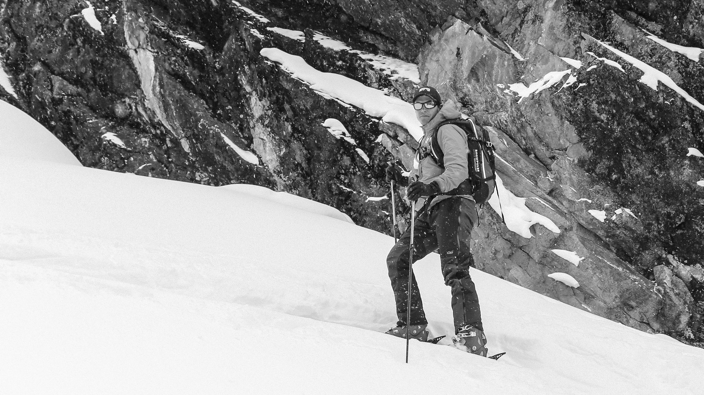

Hi.  My name is Andrew, this is my personal blog - mostly to practice writing and post photos from trips and projects.  I've learned a lot from the personal blogs of many people in business, web development, and design. I hope to share something useful to pay it forward.

## What I'm Doing
I current own and run a company called [Agema](https://www.agema.io). We're a team that solves complex business problems focused on the intersection of people, proceses, and technology. We work with mid-sized companies, and some startups, to create the culture, systems and infrastructure for rapid growth.

